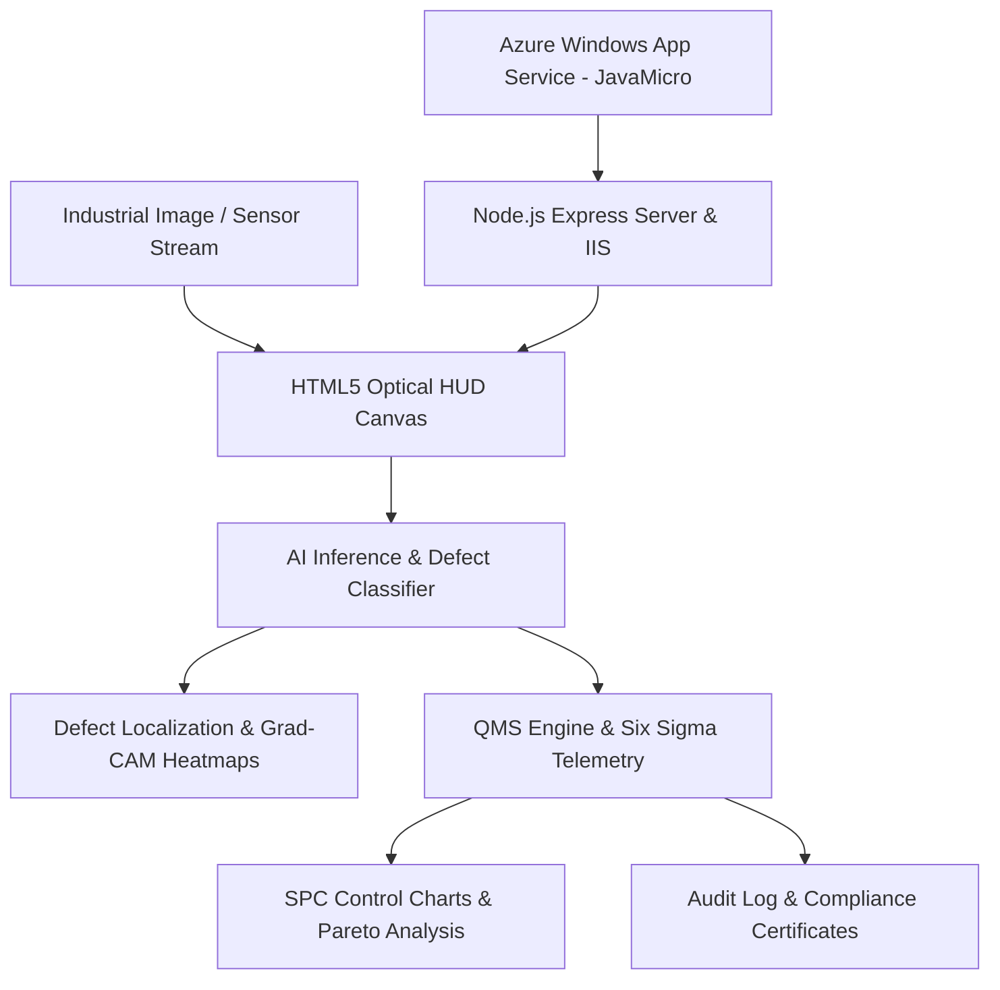

# AI-Powered Industrial Visual Inspection and Quality Management System

An Industry 4.0 automated visual quality assurance portal with real-time computer vision defect localization, Grad-CAM anomaly heatmaps, automated high-speed conveyor simulation, and Six Sigma Statistical Process Control (SPC) analytics.

Deployed on **Microsoft Azure App Service** (`JavaMicro`).

---

## 🌟 Key Project Highlights

- **Real-Time Computer Vision Defect Detection**:
  - Detects structural and surface defects with bounding boxes, confidence scores, and severity classifications across diverse industrial domains:
    1. **Electronics (SMT PCB)**: Solder bridges, missing chip capacitors, substrate micro-cracks.
    2. **Mechanical (CNC Gears & Castings)**: Surface porosity gas voids, tooling abrasions.
    3. **Automotive (Robotic Laser Welding)**: Longitudinal seam cracks, blowholes.
    4. **Clean Energy (Solar PV Wafers)**: Electroluminescent micro-fissures, broken busbars.
    5. **Pharmaceuticals (Blister Packs)**: Missing dosages, broken perimeter seals.
- **Explainable AI (XAI) Overlays**:
  - Grad-CAM style Anomaly Heatmaps.
  - Sobel High-Pass Edge Detection filters.
  - Interactive confidence threshold sliders.
- **High-Speed Conveyor Belt Simulator**:
  - Optical trigger simulation with real-time pneumatic reject actuator.
  - Web Audio API acoustic feedback (Pass chime vs. Defect alert buzz).
- **Six Sigma & Quality Management System (QMS)**:
  - **Pareto Analysis**: 80/20 root cause defect distribution.
  - **Statistical Process Control (SPC)**: $\bar{X}$ Run Chart with Upper Control Limit ($UCL = +3\sigma$) and Lower Control Limit ($LCL = -3\sigma$).
  - **Live Manufacturing KPIs**: Total Inspected, First Pass Yield (FPY %), Defect Rate (%), Parts Per Million (PPM), and OEE (%).
- **Compliance & Auditing**:
  - Exportable CSV audit logs.
  - Printable / PDF ISO 9001:2015 & IPC-A-610 Digital Quality Compliance Certificates.
  - QA Operator Review & Override station.
- **Cloud-Ready for Azure App Service**:
  - Optimized with `web.config` and Express server for Windows Azure App Service (`JavaMicro`).

---

## 🏗️ System Architecture



---

## 📐 Mathematical & Quality Formulas Used

1. **First Pass Yield (FPY)**:
   $$\text{FPY} = \left( \frac{\text{Passed Units}}{\text{Total Inspected Units}} \right) \times 100$$

2. **Defect Density (PPM - Parts Per Million)**:
   $$\text{PPM} = \left( \frac{\text{Defective Units}}{\text{Total Inspected Units}} \right) \times 1,000,000$$

3. **Statistical Process Control (SPC 3-Sigma Limits)**:
   $$\text{UCL} = \bar{X} + 3\sigma$$
   $$\text{LCL} = \max(0, \bar{X} - 3\sigma)$$

---

## 🚀 Quick Start (Local Execution)

1. Clone or open the project folder in terminal:
   ```bash
   cd "c:\Users\prakash\Desktop\Java Micro"
   ```
2. Install dependencies:
   ```bash
   npm install
   ```
3. Start the server:
   ```bash
   npm start
   ```
4. Open [http://localhost:8080](http://localhost:8080) in your web browser.

*(Alternatively, you can open `public/index.html` directly in any web browser without running a server).*

---

## ☁️ Azure App Service Deployment

Refer to [`deploy-guide.md`](file:///c:/Users/prakash/Desktop/Java%20Micro/deploy-guide.md) for full instructions on deploying to Azure App Service (`JavaMicro`).

---

## 🎓 Microproject Viva Q&A Reference

- **Q: Why use AI for industrial visual inspection instead of manual inspection?**
  *A:* Manual human inspection suffers from fatigue, inconsistent subjectivity, slow cycle times (seconds per part), and an average error rate of 10–20%. AI-powered visual inspection delivers millisecond inference (<20ms), 99%+ repeatable precision, continuous 24/7 operation, and automatic Six Sigma telemetry.

- **Q: What is the purpose of the Grad-CAM heatmap overlay?**
  *A:* Grad-CAM (Gradient-weighted Class Activation Mapping) provides Explainable AI (XAI) by highlighting the exact feature regions the neural network focused on to flag a defect, allowing QA engineers to verify the decision.

- **Q: How does the SPC Control Chart detect manufacturing anomalies?**
  *A:* It plots batch defect rates against Upper and Lower Control Limits ($\pm 3\sigma$). Any sample point crossing the UCL triggers an immediate line alert before defective batches reach customers.
